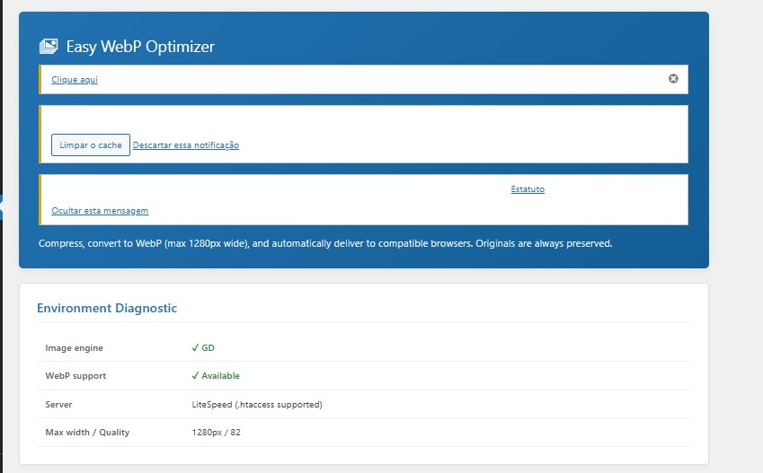
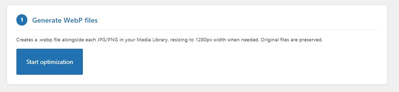
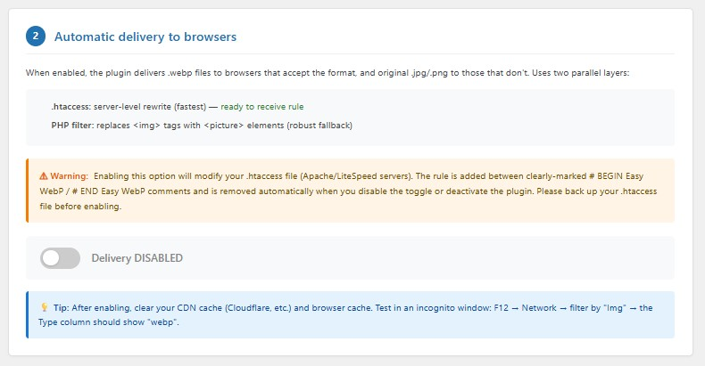

# Easy WebP Optimizer

<p>
  
  
  
  
  
</p>

A **lightweight WordPress plugin** for bulk converting JPG/PNG images to the modern WebP format, with proportional resizing and automatic delivery to compatible browsers.

**No API key. No paid plans. No usage limits.**

---

## ✨ Features

- 🔄 **Bulk conversion** of your entire Media Library with one click
- 📐 **Proportional resizing** to a maximum width of 1280px (mobile-first)
- 🚀 **Two-layer automatic delivery**:
  - `.htaccess` rewrite rule (Apache/LiteSpeed)
  - PHP `<picture>` filter as fallback (Nginx and edge cases)
- 🔒 **Originals preserved** — never modified or deleted
- ⏭️ **Idempotent processing** — already-converted images are skipped
- 📊 **Real-time progress bar** with detailed log and savings statistics
- 🧹 **Clean uninstall** — removes all options, post meta, and `.htaccess` rules
- 🏠 **100% local processing** — your images never leave your server

---

## 📸 Screenshots

### Environment Diagnostic

*Main panel displays a complete environment diagnostic: image engine (GD/Imagick), WebP support, server (Apache/LiteSpeed/Nginx) and max width/quality configuration.*

### Generate WebP files

*Creates a `.webp` file alongside each JPG/PNG in the Media Library, resizing to 1280px width when needed. **Original files are always preserved.***

### Automatic delivery to browsers

*Delivers `.webp` files automatically to compatible browsers, with fallback to JPG/PNG. Supports two layers: `.htaccess` rewrite rule (fastest) and PHP filter that replaces `` with `<picture>` elements (robust fallback).*

---

## 🚀 Installation

### Option 1 — Download the latest release

1. Go to the [Releases page](https://github.com/marcelovianaandrade/easy-webp-optimizer/releases)
2. Download `easy-webp-optimizer.zip` from the latest release
3. In WordPress: **Plugins → Add New → Upload Plugin**
4. Select the `.zip` and click **Install Now**
5. Activate the plugin

### Option 2 — Clone via Git

```bash
cd wp-content/plugins/
git clone https://github.com/marcelovianaandrade/easy-webp-optimizer.git
```

Then activate the plugin in **Plugins** menu.

### Option 3 — Manual upload via FTP

1. Download or clone this repository
2. Upload the `easy-webp-optimizer` folder to `/wp-content/plugins/`
3. Activate in WordPress admin

---

## 📖 Usage

1. After activation, go to **Media → WebP Optimizer**
2. Review the **Environment Diagnostic** panel (Imagick/GD, WebP support, server type)
3. Click **Start optimization** to generate WebP files for your existing library
4. (Optional) Enable the **automatic delivery toggle** to serve WebP to compatible browsers
5. Clear your CDN/cache and test in an incognito browser window

> ⚠️ **Backup your `.htaccess` file before enabling automatic delivery.** The plugin requires explicit confirmation via a dialog before any modification.

---

## ⚙️ Configuration

The plugin works out of the box. To customize, edit these constants at the top of `easy-webp-optimizer.php`:

```php
define( 'EASY_WEBP_MAX_WIDTH', 1280 );   // Maximum width in pixels
define( 'EASY_WEBP_QUALITY', 82 );       // WebP quality (0-100)
define( 'EASY_WEBP_BATCH_SIZE', 5 );     // Images per AJAX batch
```

### Recommended values

| Use case | Max width | Quality |
|---|---|---|
| **Mobile-first** (default) | 1280px | 82 |
| **Balanced** | 1600px | 82 |
| **High-quality photography** | 1920px | 85 |
| **Print-quality / zoom** | 2048px | 88 |

---

## 🌐 Server Compatibility

| Server | Delivery method | Status |
|---|---|---|
| **Apache** | `.htaccess` + PHP filter | ✅ Full support |
| **LiteSpeed** | `.htaccess` + PHP filter | ✅ Full support |
| **Nginx** | PHP filter only | ✅ Works (manual `nginx.conf` rule recommended) |
| **Cloudflare** | Works alongside CDN | ✅ Purge cache after enabling |

### Server requirements

- PHP 7.4 or higher
- One of:
  - **Imagick** extension with WebP support *(preferred — uses Lanczos filter, respects EXIF orientation)*
  - **GD** extension with `imagewebp()` function available

The plugin's diagnostic panel detects your environment automatically.

---

## ❓ FAQ

### Will this plugin delete or replace my original images?

**No.** The plugin generates a `.webp` file alongside each `.jpg`/`.png`. Originals are never modified or deleted.

### Does it modify my `.htaccess` file?

**Only when you explicitly enable the delivery toggle and confirm via dialog.** The rule is added between clearly-marked `# BEGIN Easy WebP` / `# END Easy WebP` comments. It's removed automatically on disable or uninstall.

### What if I'm on Nginx?

The plugin detects Nginx and skips `.htaccess` modification. The PHP `<picture>` filter handles delivery instead.

### Does it work with Cloudflare?

Yes. Purge your Cloudflare cache after enabling delivery. If you have Cloudflare Polish (Pro+) with WebP, this plugin's bulk conversion is still useful for storage savings.

### Does it work with Elementor, WooCommerce, and page builders?

Yes. The PHP filter operates on `the_content` and `wp_get_attachment_image` hooks, covering most page builders and product galleries.

### Does the plugin send data to external servers?

**No.** All processing is local. No API calls, no telemetry, no "phone home" behavior.

### How do I revert all changes?

1. Disable the delivery toggle (removes `.htaccess` rule)
2. Deactivate the plugin (also removes the rule)
3. Optionally delete `.webp` files: `find wp-content/uploads -name "*.webp" -delete`

---

## 🤝 Contributing

Contributions are welcome! Here's how:

- 🐛 **Bug reports** — open an [issue](https://github.com/marcelovianaandrade/easy-webp-optimizer/issues/new?template=bug_report.md)
- 💡 **Feature requests** — open an [issue](https://github.com/marcelovianaandrade/easy-webp-optimizer/issues/new?template=feature_request.md)
- 🔧 **Pull requests** — fork, create a feature branch, and submit a PR

Please follow [WordPress Coding Standards](https://developer.wordpress.org/coding-standards/wordpress-coding-standards/) for any code contributions.

---

## 📜 License

This plugin is licensed under the **GNU General Public License v2.0 or later**.

See [LICENSE](LICENSE) for the full text.

---

## 🙋 Author

**Marcelo V. Andrade**

- 💻 GitHub: [@marcelovianaandrade](https://github.com/marcelovianaandrade)
- 💼 LinkedIn: [linkedin.com/in/marcelovianaandrade](https://www.linkedin.com/in/marcelovianaandrade)
- 🌐 Website: [projetowebstudio.com.br](https://projetowebstudio.com.br)

---

<p align="center">
  <i>Built with care for the WordPress community.</i><br>
  <i>If this plugin helped you, consider starring the repo ⭐</i>
</p>
